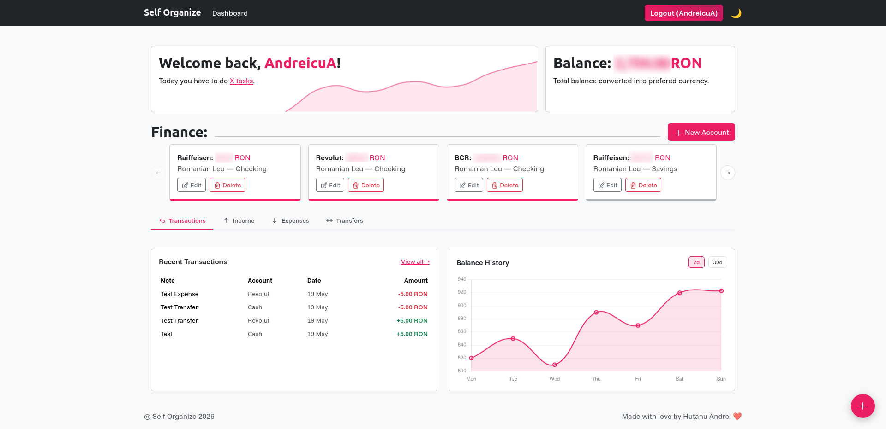
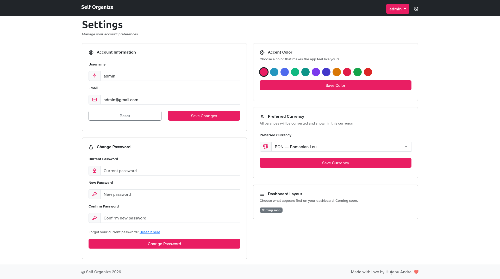

<p align="center">
  <h1 align="center">Self Organize</h1>
  <p align="center">A personal life-management web app — finances, tasks, habits, and projects in one place.</p>
</p>

<p align="center">
  
  
  
  
  
</p>

---

<picture>
  <source media="(prefers-color-scheme: dark)" srcset="docs/images/HomepageDark.png">
  <source media="(prefers-color-scheme: light)" srcset="docs/images/HomepageLight.png">
  
</picture>

---

## What it is

Self Organize is a full-stack personal productivity platform built as a PWA. It runs in the browser, installs on your phone like a native app, and is designed to be fast enough to use one-handed at a grocery store.

The goal is simple: one app that covers your finances, daily tasks, habits, and projects — without the clutter of five separate tools.

---

## Features

### Finance
- Multiple accounts in different currencies with automatic conversion to your preferred currency
- Income, expense, and transfer tracking
- Balance history charts (7d / 30d)
- Daily income and expense bar charts
- Monthly stats summary (income, expenses, transfers)
- Exchange rates fetched and cached automatically

### Tasks
- Categorized to-do lists
- Quick-add from anywhere via the floating action button
- Daily overview on the dashboard

### Habits *(coming soon)*
- Daily check-ins and streaks
- Progress tracking over time

### Projects *(coming soon)*
- Per-project to-dos separated from main tasks
- Goals, resources, and useful links
- Pin active projects to your dashboard

---

## Screenshots

<picture>
  <source media="(prefers-color-scheme: dark)" srcset="docs/images/DashboardDark.png">
  <source media="(prefers-color-scheme: light)" srcset="docs/images/DashboardLight.png">
  
</picture>

<picture>
  <source media="(prefers-color-scheme: dark)" srcset="docs/images/SettingsDark.png">
  <source media="(prefers-color-scheme: light)" srcset="docs/images/SettingsLight.png">
  
</picture>

---

## Tech stack

| Layer | Technology |
|---|---|
| Backend | PHP 8, Yii2 |
| Database | MySQL / MariaDB |
| Frontend | Bootstrap 5, Chart.js, Vanilla JS |
| Auth | Yii2 built-in user identity |
| PWA | Web App Manifest + Service Worker |
| Dev environment | DDEV |

---

## Getting started

### Requirements
- PHP 8.1+
- MySQL / MariaDB
- Composer
- DDEV (recommended) or any local PHP server

### Installation

```bash
# Clone the repository
git clone https://github.com/andreicud/selforganize
cd selforganize

# Install dependencies
composer install

# Copy and configure environment
cp config/db.example.php config/db.php
# Edit config/db.php with your database credentials
```

### With DDEV

```bash
ddev start
ddev composer install
```

Then open `https://self-organize.ddev.site` in your browser.

---

## Configuration

**`config/params.php`** — set your support email and token expiry:
```php
return [
    'adminEmail'                    => 'admin@example.com',
    'supportEmail'                  => 'support@example.com',
    'user.passwordResetTokenExpire' => 86400,
];
```

**`config/db.php`** — database connection:
```php
return [
    'class'    => 'yii\db\Connection',
    'dsn'      => 'mysql:host=localhost;dbname=self_organize',
    'username' => 'root',
    'password' => '',
    'charset'  => 'utf8',
];
```
*/
---

## Personalization

Every user can customize their experience from the settings page:

- **Accent color** — choose from 10 curated presets. Applied instantly across the entire UI via CSS variables.
- **Preferred currency** — all account balances are converted and displayed in your chosen currency.
- **Dark / light mode** — persisted per device.

---

## Project structure
